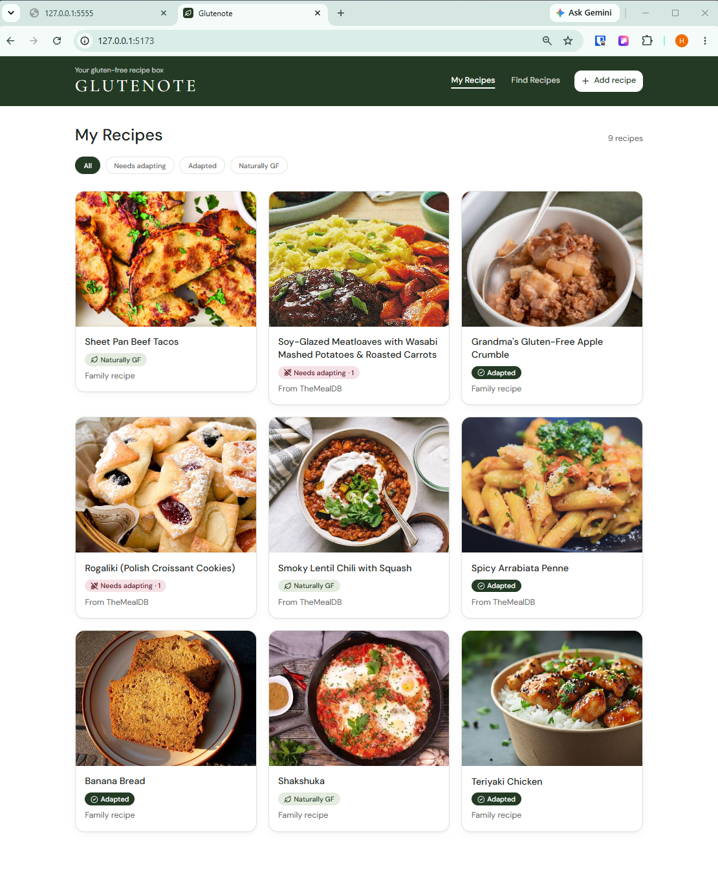
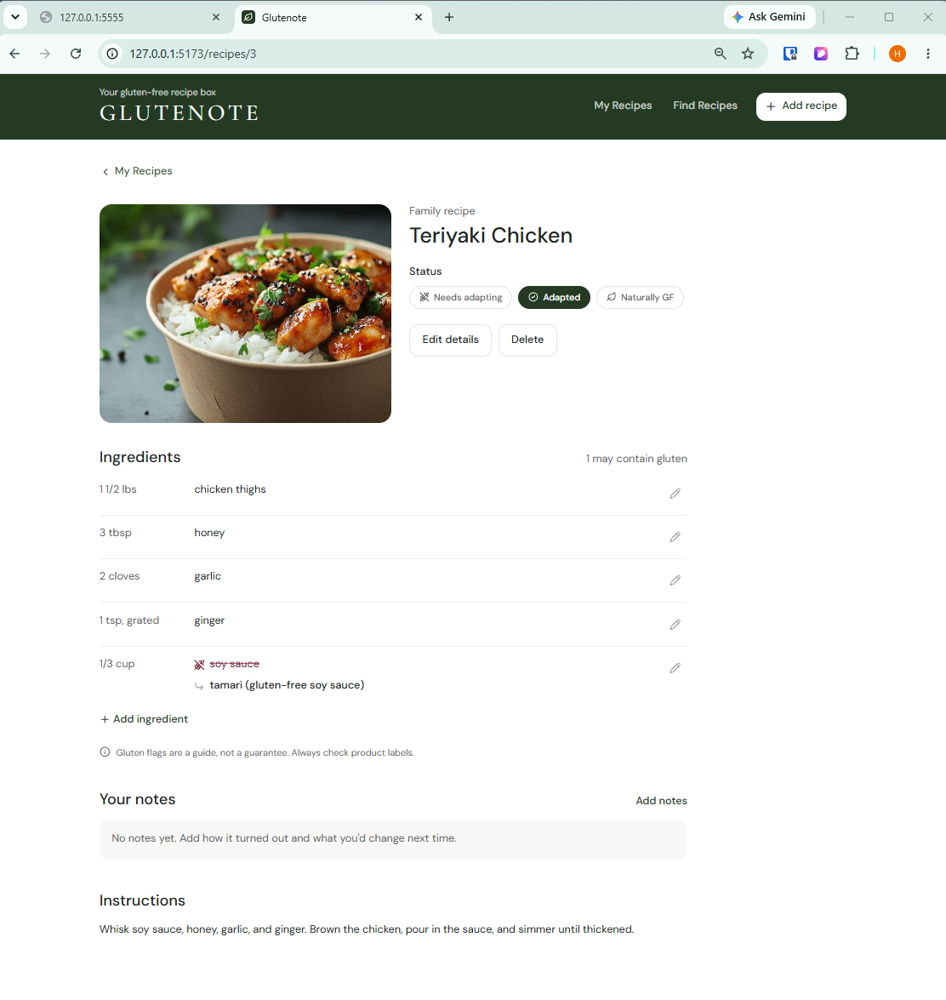
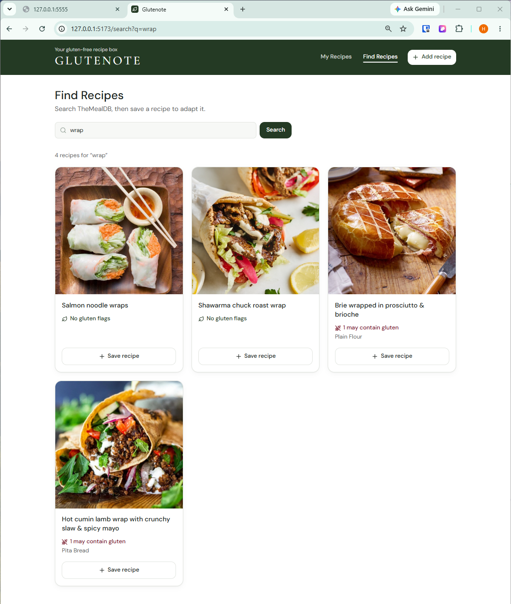

# Glutenote

**Remember every swap that worked.**

Glutenote is a gluten-free recipe box. Save family recipes or find new ones on TheMealDB, see which ingredients may contain gluten, and record the gluten-free swaps that worked, so you never have to figure out the same recipe twice.

Built with React, Flask, and PostgreSQL for the Flatiron School Software Engineering Capstone (Project 1).



## Features

- **My Recipes:** every saved recipe as a card, with a status badge and a filter for each status
- **Three gluten-free statuses:** *Needs adapting* (with a count of swaps still needed), *Adapted*, and *Naturally GF*
- **Gluten flagging:** ingredients that may contain gluten are flagged automatically, using a keyword check with known gluten-free exceptions (e.g., rice flour and tamari are not flagged)
- **Swaps:** record a gluten-free substitute for any flagged ingredient. When every flagged ingredient has a swap, Glutenote offers to mark the recipe as adapted
- **Notes:** keep your own notes on each recipe ("used 1:1 GF flour, came out great")
- **Find Recipes:** search TheMealDB, preview which ingredients would be flagged, and save a recipe to start adapting it
- **Add and edit family recipes**, including ingredients, instructions, and a photo link

> Gluten flagging is a keyword check, not a guarantee. Always check product labels.

## Screenshots

| Recipe detail | Find Recipes |
|---|---|
|  |  |

## Tech Stack

- **Frontend:** React (Vite), React Router, Tailwind CSS, Lucide icons
- **Backend:** Flask, Flask-SQLAlchemy, Flask-Migrate, Flask-CORS
- **Database:** PostgreSQL
- **External API:** [TheMealDB](https://www.themealdb.com/api.php) (free, no key needed)
- **Testing:** pytest

## Installation

You'll need Python 3.12, Node.js, and PostgreSQL.

### 1. Clone the repo

```bash
git clone https://github.com/hanjennings1/glutenote.git
cd glutenote
```

### 2. Set up the backend

```bash
cd backend
python -m venv venv
source venv/bin/activate
pip install -r requirements.txt
```

Create a PostgreSQL database named `glutenote_dev`:

```bash
createdb glutenote_dev
```

Copy the environment template, then open `.env` and fill in your PostgreSQL username and password:

```bash
cp .env.example .env
```

Create the tables and add the sample recipes:

```bash
flask --app app db upgrade
python seed.py
```

Start the API (it runs at http://localhost:5555):

```bash
python app.py
```

### 3. Set up the frontend

In a second terminal, from the `glutenote` folder:

```bash
cd frontend
npm install
npm run dev
```

Open http://localhost:5173 in your browser.

## Usage

1. **Find a recipe:** go to **Find Recipes**, search for a dish (e.g., "lasagne"), and click **Save recipe**.
2. **Adapt it:** on the recipe page, flagged ingredients are marked with a wheat icon. Click **Add swap** to record a gluten-free substitute.
3. **Mark it adapted:** once every flagged ingredient has a swap, click **Mark as adapted**.
4. **Add a family recipe:** click **Add recipe**, fill in the basics, then add ingredients on the next page.
5. **Filter:** on **My Recipes**, filter by status to see what still needs adapting.

## API

All responses are JSON. Errors always use the shape `{"error": "message"}`.

| Method | Route | Description |
|---|---|---|
| GET | `/recipes` | List all recipes. Optional `?status=needs_adapting`, `adapted`, or `naturally_gf` |
| GET | `/recipes/<id>` | One recipe, with its ingredients |
| POST | `/recipes` | Create a recipe (optionally with ingredients) |
| PATCH | `/recipes/<id>` | Update a recipe's title, instructions, photo, status, or notes |
| DELETE | `/recipes/<id>` | Delete a recipe and its ingredients |
| POST | `/ingredients` | Add an ingredient to a recipe (needs `recipe_id`) |
| PATCH | `/ingredients/<id>` | Update an ingredient, e.g., record a gluten-free swap |
| DELETE | `/ingredients/<id>` | Delete an ingredient |
| GET | `/search?q=` | Search TheMealDB. Returns previews with gluten flags (nothing is saved) |
| POST | `/recipes/import` | Save a TheMealDB recipe by `mealdb_id`, with gluten flagged |

**Status codes:** 200 OK, 201 created, 204 deleted, 400 invalid input, 404 not found, 409 recipe already saved, 502 TheMealDB unavailable.

**Example:** record a swap

```http
PATCH /ingredients/14
Content-Type: application/json

{ "gf_substitute": "1:1 gluten-free flour blend" }
```

## Running Tests

The backend has 42 tests covering gluten flagging, TheMealDB parsing, and every API route. The tests use a temporary in-memory database and a fake TheMealDB, so they don't need PostgreSQL or an internet connection, and they never touch your saved recipes.

```bash
cd backend
source venv/bin/activate
pytest
```

## Project Structure

```
├── frontend/                      React + Vite frontend
│   ├── index.html                 Page shell, title, DM Sans font
│   ├── package.json               Frontend dependencies and scripts
│   ├── vite.config.js             Vite + Tailwind CSS setup
│   ├── public/
│   │   └── favicon.svg            Glutenote browser-tab icon
│   └── src/
│       ├── main.jsx               Starts React with the router
│       ├── App.jsx                NavBar and page routes
│       ├── api.js                 apiFetch helper for calling Flask
│       ├── index.css              Tailwind theme: colors, font, radius
│       ├── statuses.js            The 3 gluten-free statuses and labels
│       ├── ui.js                  Shared button and input styles
│       ├── components/            NavBar, RecipeCard, StatusBadge, StatusPicker,
│       │                          IngredientList, IngredientItem, AddIngredientForm,
│       │                          NotesEditor, SearchResult, LoadingSpinner, ErrorMessage
│       └── pages/
│           ├── RecipeList.jsx     My Recipes, with status filters
│           ├── RecipeDetail.jsx   One recipe: ingredients, status, notes
│           ├── RecipeForm.jsx     Add or edit a recipe
│           ├── SearchPage.jsx     Find Recipes (TheMealDB search)
│           └── NotFound.jsx       404 page
├── backend/                       Flask API
│   ├── app.py                     API routes
│   ├── config.py                  App, database, and CORS setup
│   ├── models.py                  Recipe and Ingredient models
│   ├── gluten.py                  Flags ingredients that may contain gluten
│   ├── mealdb.py                  TheMealDB search and lookup
│   ├── seed.py                    Adds sample recipes
│   ├── migrations/                Database migrations (Flask-Migrate)
│   ├── tests/                     pytest tests (42)
│   ├── pytest.ini                 pytest settings
│   ├── requirements.txt           Python dependencies
│   └── .env.example               Template for environment variables
├── screenshots/                   Images for this README
└── README.md
```

## Future Improvements

- Search and sort within My Recipes
- A fourth status, *Proven*, for adapted recipes you've made and liked
- Rate how well each swap worked

## Acknowledgments

Recipe data and photos from [TheMealDB](https://www.themealdb.com/).